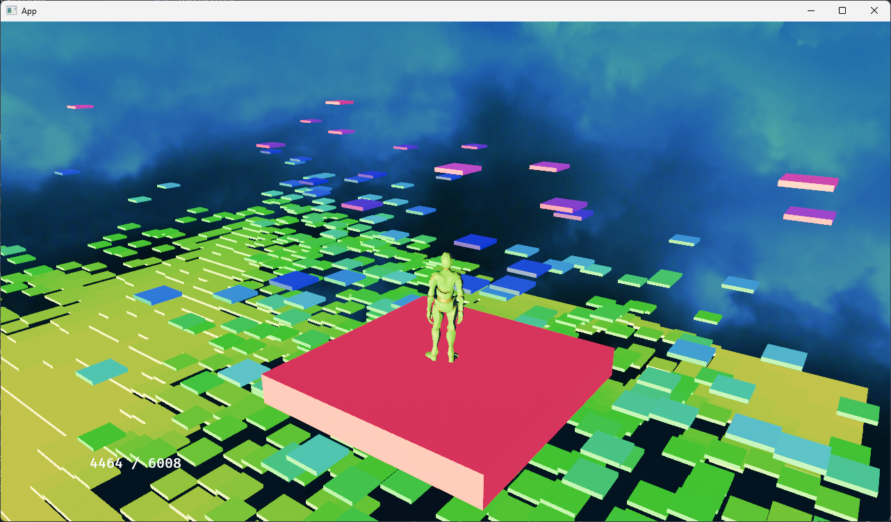
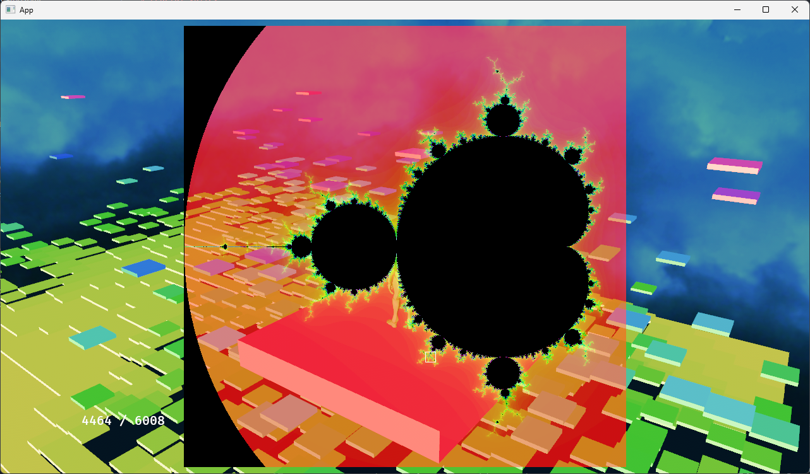

# Fractal Valley
## Description
Absolutelly ueseless project.  
I just wanted to jump around the fractal  

[Demo](https://xenon615.github.io/fractal-valley/)

## Controls
Key M -Toggle Map / Area  
### Map Mode  
LMB : Select area  
RMB : Zoom In
LShift + RMB : Zoom Out  

### Area Mode
LShift + LMB : Jump To Cell 
RMB Drag : Rotate character  
LMB Drag : Rotate camera  
Wheel : camera distance  

## Images

### Credits
Interstellar skybox   
[Jockum Skoglund aka hipshot](https://www.zfight.com)

3D Models  
[Mixamo](https://www.mixamo.com/)

