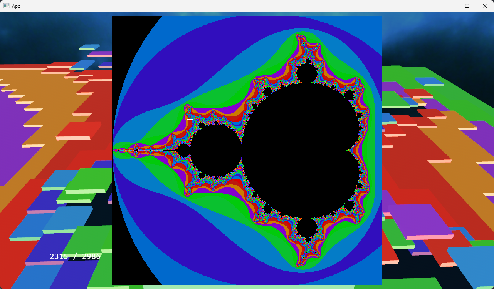

# Fractal Valley
## Description
Absolutelly ueseless at this point project which is an attempt to explore some of the possibilities of Bevy Engine v0.15.  
The idea was to take the Mandelbrot fractal and try to do something with it
## Controls
Key M -Toggle Map  
### Map Mode  
LMB : Select area  
RMB : Zoom In
LShift + RMB : Zoom Out  

### Area Mode
LShift + LMB : Move To Cell 
RMB Drag : Rotate character  
LMB Drag : Rotate camera  
Wheel : camera distance  

## Images

### Credits
Interstellar skybox   
[Jockum Skoglund aka hipshot](https://www.zfight.com)

3D Models  
[Mixamo](https://www.mixamo.com/)

